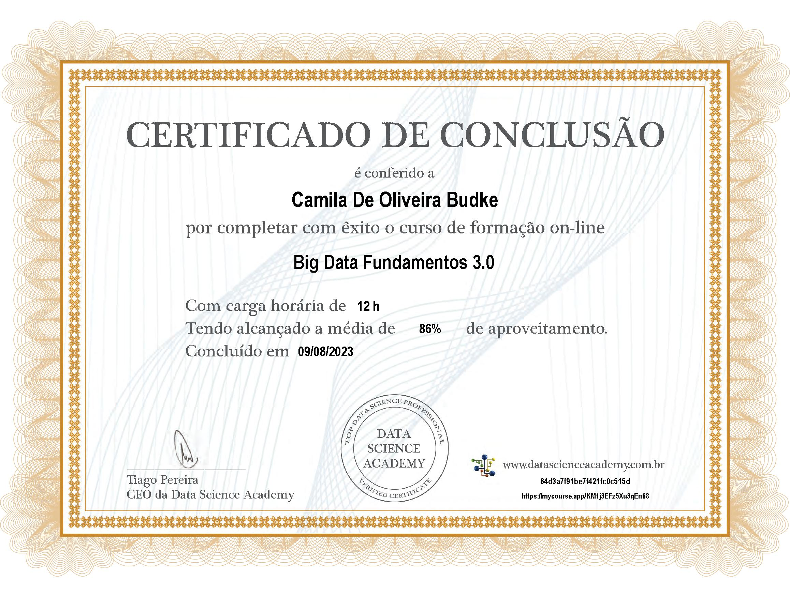

# Big Data e Ciência de Dados

## Sumário
>
> - [x] [Fundamentos | Big Data](#fundamentos--big-data)
> - [x] [Fundamentos | Ciência de Dados](#fundamentos--ciência-de-dados)
> - [x] [Links e outras Referências](#links-e-outras-referências)
> - [x] [Certificado](#certificado)
>

## Fundamentos | Big Data
>
> - [O que é Big Data?](big-data_sobre.md)
> - [Armazenamento e Processamento Paralelo](armaz-e-processamento-paralelo.md)
> - [Cloud Computing](cloud-computing.md)
> - [MLOps e DataOps](ml-e-data-ops.md)
> - [Dados como Serviço](daas.md)
> - [Integração de Dados | ETL e ELT](integracao-de-dados-etl-elt.md)
> - [Como iniciar um projeto de Big Data?](iniciando-projeto.md)
> 

## Fundamentos | Ciência de Dados
>
> - [Ciência de Dados e Analytics](ciencia-de-dados.md)
>
## Links e outras Referências
> 
> - [Data Science Academy | Cursos Gratuitos](https://www.datascienceacademy.com.br/cursosgratuitos)
>

## Certificado
>
> 
