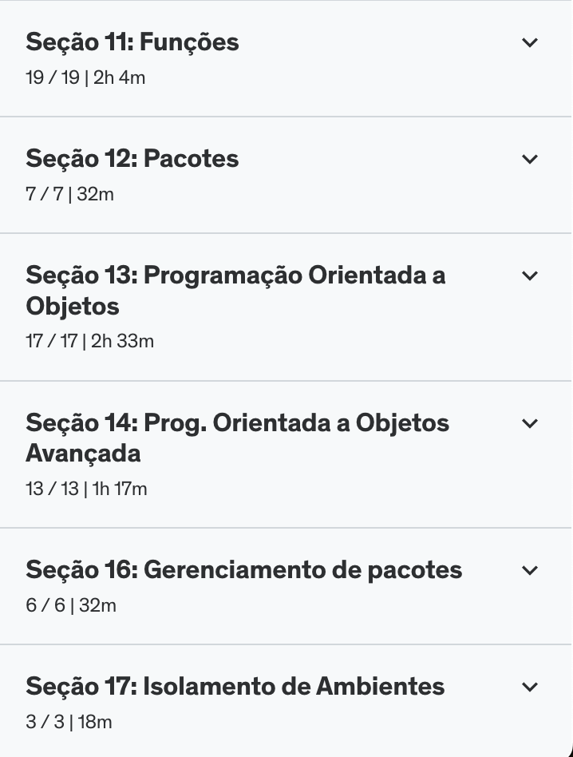
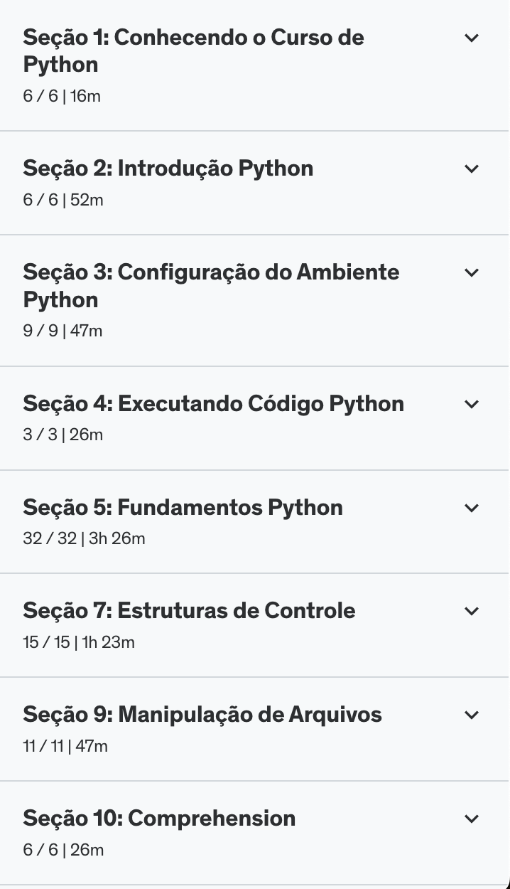

## Sumário | Python

- [] Setup
- [] Fundamentos
- [] Exercícios
- [] Links e outras referências
- [] Certificado
      
## Setup 
>
> ### Python
>
> Antes de configurar o ambiente, verifique se você já tem a instalação.
> 
>     python --version
> 
> Caso não tenha a instalação, entre no [site](https://www.python.org/downloads/) e baixe a versão mais atualizada e estável, de acordo com o sistema operacional da sua máquina.
>
> Após realizar a instalação, siga os passos do instalador e seu ambiente estará pronto para execução.
> 
> ### Anaconda | Jupyter Notebook
>
> Entre no [site](https://www.anaconda.com/) e baixe de acordo com o seu sistema operacional e siga os passos para as configurações do instalador.
>
> Após instalar, inicialize o aplicativo e faça o `Lauch` o Jupyter Notebook. O servidor irá inicializar pelo terminal da sua máquina e o navegador será aberto para a página de documentos da sua máquina pelo Jupyter Notebook.
>
> #### Legenda de cores na interface 
>
> 
> - Verde: Modo de Edição
>   - Tecle `control` + `Enter` para executar o código
> 
> - Azul: Modo de Comando
>   - Tecle `esc` para entrar
>   - Tecle `enter` para sair
>   - Tecle `l` para adicionar o número das linhas
>   - Tecle `b` para adicionar uma nova linha abaixo da linha atual
>   - Tecle `a` para adicionar uma nova linha acima da linha atual
>   - Tecle `dd` para remover a linha
>   - Tecle `1` ou `m` para entrar em modo de Markdown
>
> [Voltar para o topo](#sumário--python)

## Fundamentos
>
> - [Caderno Notebook](./curso-cod3r/fundamentos-py.ipynb)
>
> [Voltar para o topo](#sumário--python)

## Exercícios

- [ ][Exercício 1](./exercicios/parte-1/ex01.py)
- [ ][Exercício 2](./exercicios/parte-1/ex02.py)
- [ ][Exercício 3](./exercicios/parte-1/ex03.py)
- [ ][Exercício 4](./exercicios/parte-1/ex04.py)
- [ ][Exercício 5](./parte-1/ex05.py)
- [ ][Exercício 6](./exercicios/parte-2/ex06_set.py)
- [ ][Exercício 7](./exercicios/parte-2/ex07.py)
- [ ][Exercício 8](./exercicios/parte-2/ex08.py)
- [ ][Exercício 9](./exercicios/parte-2/ex09.py)
- [ ][Exercício 10](./exercicios/parte-2/ex10.py)
- [ ][Exercício 11](./exercicios/parte-2/ex11.py)
- [ ][Exercício 12](./exercicios/parte-2/ex12_parsing.py)
- [ ][Exercício 13](./exercicios/parte-2/ex13.py)
- [ ][Exercício 14](./exercicios/parte-2/ex14.py)
- [ ][Exercício 15](./exercicios/parte-2/ex15_classe.py)
- [ ][Exercício 16](./exercicios/parte-2/ex16.py)
- [ ][Exercício 17](./exercicios/parte-2/ex17.py)
- [ ][Exercício 18](./exercicios/parte-2/ex18_dicionario.py)
- [ ][Exercício 19](./exercicios/parte-2/ex19_mediana.py)
- [ ][Exercício 20](./exercicios/parte-2/ex20.py)
- [ ][Exercício 21](./exercicios/parte-3-poo/ex21_heranca.py)
- [ ][Exercício 22](./exercicios/parte-3-poo/ex22_name-mangling.py)
- [ ][Exercício 23](./exercicios/parte-3-poo/ex23.py)
- [ ][Exercício 24](./exercicios/parte-3-poo/ex24.py)
- [ ][Exercício 25](./exercicios/parte-3-poo/ex25.py)
>
> [Voltar para o topo](#sumário--python)

## Links e Referências
>
> - [PEP 8](https://peps.python.org/pep-0008/)
> 
> PDFs e Apostilas para consulta
> - [PDF | Básico ao Avançado | Cod3r](./curso-python-versao-1.1.pdf)
> - [PDF | Conceitos Básicos | Modulo I](../python-modulo-1.pdf)
> - [PDF | Conceitos Básicos | Modulo II](../python-modulo-2.pdf)

> Documentação e exercícios
> - [W3Schools | Docs](https://www.w3schools.com/python/default.asp)
> - [W3Schools | Palavras reservadas](https://www.w3schools.com/python/python_ref_keywords.asp)
> - [W3Schools | Exceções](https://www.w3schools.com/python/python_ref_exceptions.asp)
> - [W3Schools | Glossário](https://www.w3schools.com/python/python_ref_glossary.asp)
> - [Kaggle | Exercícios](https://www.kaggle.com/learn/python) 

> Mapeamento de estudos
> - [Roadmap Python Developer](https://roadmap.sh/python)
> 
> [Voltar para o topo](#sumário--python)

### Certificado do curso
> 
> 
> 