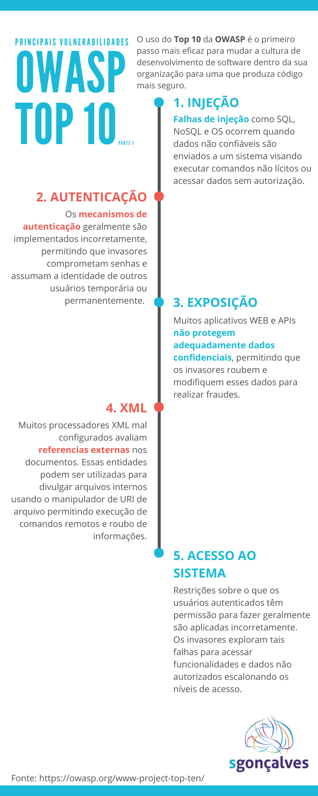
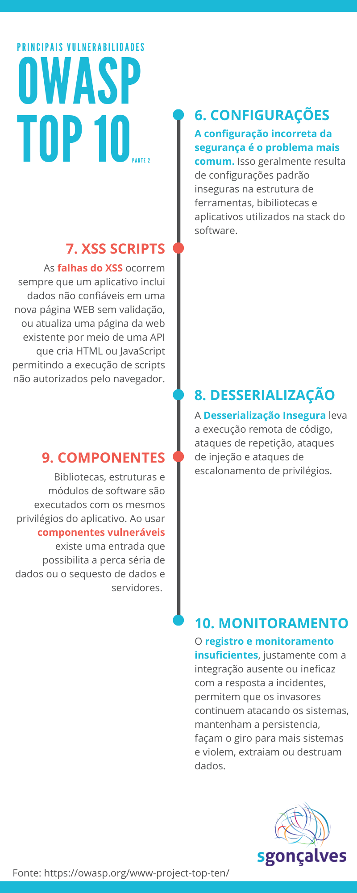
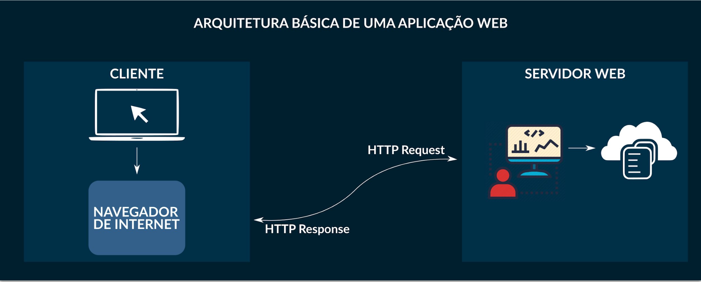

## Fundamentos
>
> ### Tópico dos conteúdos
>
> - [Princípios da Segurança da Informação](#princípios-da-segurança-da-informação)
> - [Análise de Vulnerabilidade e Tipos](#análise-de-vulnerabilidade-e-tipos)
> - [Planejamento da Análise de Vulnerabilidades](#planejamento-da-análise-de-vulnerabilidades)
> - [Arquitetura de Aplicações Web](#arquitetura-de-aplicações-web)
> - [Projeto OWASP e Ferramentas](#owasp-projeto-bwa-e-ferramentas)
>
>
> ### Princípios da Segurança da Informação
>
> 1. **Autenticidade**: a informação será autêntica se for recebida sem qualquer mutação durante o envio.
> 2. **Confidencialidade**: está relacionado à privacidade dos dados.
> 3. **Disponibilidade**: o acesso a informação será fornecida independente do momento.
> 4. **Integridade**: garante que as informações estejam em um estado verídico e correto.
> 5. **Legalidade**: garante a aderência de um sistema a legislação vigente.
>
> ### Análise de Vulnerabilidade e Tipos
>
> É uma auditoria completa do sistema buscando encontrar falhas de segurança, com o objetivo de corrigir as vulnerabilidades.
>
> ### Tipos de Teste
>
> - [Black Box](https://www.linkedin.com/pulse/tipos-de-pentest-black-box-white-e-gray-infoprotectsi/?originalSubdomain=pt): sem conhecimento da estrutura;
> - [White Box](https://www.linkedin.com/pulse/tipos-de-pentest-black-box-white-e-gray-infoprotectsi/?originalSubdomain=pt): com conhecimento da estrutura;
> - [Grey Box](https://www.linkedin.com/pulse/tipos-de-pentest-black-box-white-e-gray-infoprotectsi/?originalSubdomain=pt): com conhecimento parcial da estrutura;
>
> ### Top 10 das principais vulnerabilidades | OWAPS
>
> A [OWASP](https://owasp.org/) é uma fundação sem fins lucrativos que trabalha para melhorar a segurança de software. Assim, a comunidade trabalha fornecendo relatórios, infográficos, realizando eventos, oferecendo ferramentas e conhecimento para melhoria da segurança em softwares.
>
> 
>
> Segundo o Top 10 da OWAPS, as principais vulnerabilidades incluem:
>
> 1. **Falhas de injeção**: ocorrem quando dados não confiáveis são enviados ao sistema visando executar comandos de procedência duvidosa ou permitir o acesso a dados sem autorização;
> 2. **Autenticação**: esta se apresenta como vulnerável quando os mecanismos de autenticação são implementados incorretamente, comprometendo senhas e outros dados de valor;
> 3. **Exposição**: ocorre quando aplicativos Web e APIs não fornecem a devida proteção de dados confidenciais, o que permite a invasão e o roubo de dados.
> 4. **Entidades Externas de XML(XEE)**: processadores de XML mal configurados avaliam referências externas por meio de URIs que podem divulgar arquivos internos que permitem a execução de comandos remotos e roubo de informações.
> 5. **Acesso ao sistema**: ocorre quando as restrições e permissionamentos de usuários estão mal configuradas.
>
> 
>
> 6. **Configurações**: um exemplo é quando a configuração padrão de um sistema permanece a de fábrica, como `user: admin`; e `senha: admin`.
> 7. **Falhas no XSS Scripts**: ocorre quando (i) um app inclui dados não confiáveis em uma nova página Web sem validação; ou (ii) quando atualiza uma página Web por meio de uma API que cria HTML e JavaScript permitindo a execução de scripts não autorizados no navegador.
> 8. **Desserialização Insegura**: leva à (i) execução remota de código, (ii) ataques de repetição, (iii) ataques de injeção e (iv) ataques de escalonamento de privilégios.
> 9. **Componentes vulneráveis**: uso de bibliotecas, estruturas ou módulos de softwares não confiáveis abre espaço para o roubo e sequestro de dados.
> 10. **Monitoramento**: nossa última vulnerabilidade é referente à falta de monitoramento do sistema.
>
>
> ### Planejamento da Análise de Vulnerabilidades
>
> Antes de tudo devemos coletar os seguintes pontos:
>
> - Informações gerais da empresa;
> - Elaborar um [contrato de acordo](./report_access_pentest_anbistrade.pdf);
> - Objetivo da análise;
> - Limitações da análise;
> - Linha do tempo contendo todos os relatórios técnicos;
>
> ### Fases da Análise de Vulnerabilidades
>
> - Reconhecimento do sistema (Footprint);
> - Varredura (Scanning);
> - Exploração (Gaining Access);
> - Escalação de privilégios (Mantaining Access);
>
> ### Metodologias da Análise de Vulnerabilidades
>
> - Open Source Security Testing Methodology Manual (OSSTMM);
> - Information Systems Security Assessment Framework (ISSAF);
> - Web Application Security Consortium Threat Classification (WASC-TC);
> - **Open Web Application Security Project (OWASP);**
>
> ### Arquitetura de Aplicações Web
>
> 
>
> Ao acessar um site ou uma plataforma pelo navegador, a sua máquina envia uma requisição pelo protocolo HTTP pedindo acesso à informação de interesse, podendo ser a página de busca do Google, por exemplo. Neste momento, o servidor da Google recebe a requisição e envia como resposta, também via HTTP, a informação de interesse do usuário, no nosso caso a página com a barra de pesquisa do Google.
>
> ### Outras referências sobre como funciona a Internet
>
> - [Como a internet funciona em 5 minutos](https://www.youtube.com/watch?v=7_LPdttKXPc)
> - [Como funciona a Internet? | Computer Science .fyi](https://cs.fyi/guide/how-does-internet-work)
>

## OWASP, Projeto BWA e Ferramentas

- [Setup das ferramentas](resumo.md#setup)
> 
> A OWASP é também uma metodologia direcionada a testes em servidores e aplicações web. Os testes realizados pela ferramenta incluem:
>
> - Testes de Injeção
> - Quebra do Sistemas de Autenticação
> - Transversalidade do Diretório (Directory Transversal)
> - Upload de arquivos (File Upload)
> - Configurações Falhas
> - [Cross-site Scripting](https://pt.wikipedia.org/wiki/Cross-site_scripting) ou CSRF
> - Negação de Serviço
>
> Através do Projeto [Bronken Web Application (BWA)](https://code.google.com/archive/p/owaspbwa/) é possível testar e aprender sobre os seguintes tópicos:
>
> - Segurança de Aplicações Web
> - Técnicas de Enumeração Manual
> - Ferramentas Automatizadas para Enumeração
> - Ferramentas para Análise de Código-Fonte Vulnerável
> - Ataques na Web
> - Web Application Firewalls (WAFs) e tecnologias de código similares
>
> Por fim, podemos utilizar também o [OWASP ZAP](https://en.wikipedia.org/wiki/OWASP_ZAP) como Proxy para realizar testes de intrusão em aplicativos Web, encontrando automaticamente falhas de segurança ao desenvolver o aplicativo.
>  

## Testes de Vulnerabilidade
> - SQL Injection
> - XSS Script
> - Command Injection
> - Local/Remote File Injection (LFI/RFI)
> - TCP/IP
> - Denial of Service

## Transporte Inseguro
> - Tráfego de rede
> - SSL e TLS

## Mecanismos de Recuperação de Senhas Vulneráveis
> 
> - Brute Force | OWASP ZAP
> - Brute Force | CEWL
> - Brute Force | HYDRA

## Métodos de Descoberta Automática de Vulnerabilidades

> - OWASP ZAP
> - Nikto
> - WPScan
> - Wapiti3 | Python
> - GoLismero

## Perguntas | XSS Script

Qual código você inseriu para fazer com que o site parecesse fora do ar?

    
    
Qual código você inseriu para fazer com que sua imagem fosse exibida no site?

    

## Métodos para Proteção

### Proxy de Aplicação

> Princípios
> - Flexibilidade
> - Passividade
> - Previsibilidade
> - Qualidade acima de quantidade

### Modsecurity

É um firewall para proteção de Aplicações Web por meio de regras.

> [Voltar para o topo](#tópico-dos-conteúdos)
