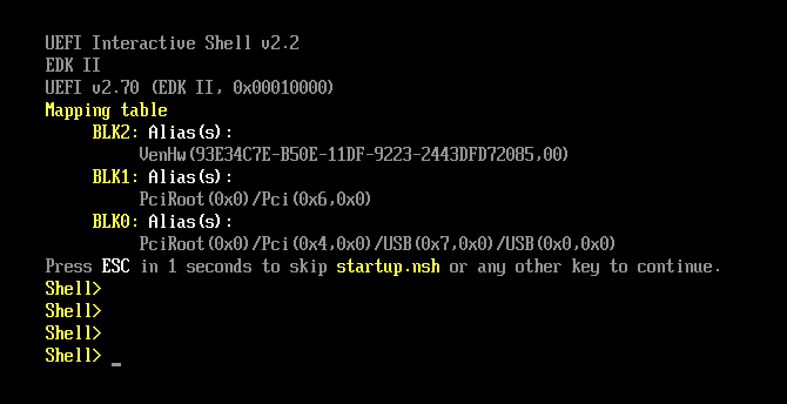
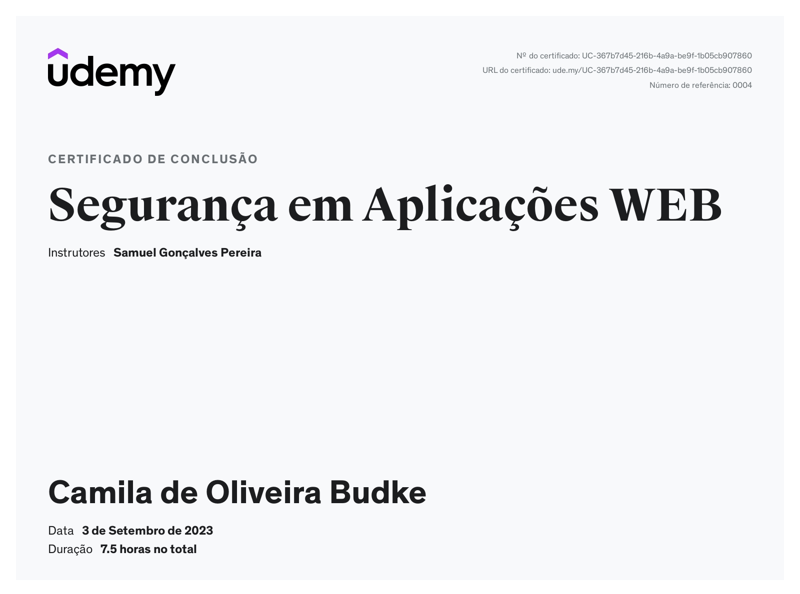

## Sumário | Segurança da Informação

- [Setup](#setup)
- [Fundamentos](fundamentos.md)
- [Links e outras referências](#links-e-outras-referências)
- [Certificado](#certificado)
      
## Setup
> 
> Você vai precisar instalar os seguintes componentes:
> 
> - [Kali Linux | UTM](https://www.kali.org/docs/virtualization/install-utm-guest-vm/)
> - [OWASP Broken Web Apps](https://sourceforge.net/projects/owaspbwa/)
> 
> ### Instalação do OWASPBWA para Mac com arquitetura M1 Chip [Não resolvido]
> 
> Para configurar o Kali Linux na VM da UTM, basta seguir esse [tutorial do site oficial](https://www.kali.org/docs/virtualization/install-utm-guest-vm/). Entretanto, ao tentar fazer o mesmo para o arquivo [.ova](https://sourceforge.net/projects/owaspbwa/) do OWASP Broken Web Apps, aparece a seguinte interface de incialização:
> 
> 
> 
> Isso acontece pois o formato `.ova` só pode ser lido pelo [VMware](https://www.vmware.com/) e [VirtualBox](https://www.virtualbox.org/), que são emuladores/máquinas virtuais para arquiteturas Intel. 
> 
> Para seguirmos com a instalação do OWASPBWA, existe a possibilidade, fornecida por [yohilo](https://www.appleayuda.com/pregunta/87153/como-cargar-ova-en-el-chip-mac-m1), de [fazer a conversão](https://github.com/utmapp/UTM/discussions/2521) de `.ova` para `.qcow2` e, assim, emular um sistema com arquitetura Intel pela UTM. Dessa forma, após baixar o arquivo `.ova`, podemos continuar a configuração, pelos seguintes passos:
> 
> 1. [Converta o `.ova` para `.qcow2` por uma VM em Linux](https://www.xmodulo.com/convert-ova-to-qcow2-linux.html)
> 2. [Continue o passo a passo pela discussão do problema no GitHub](https://github.com/utmapp/UTM/discussions/2521#discussioncomment-4110452)
> 

## Links e outras referências
>
> - [OWASP |GitHub](https://github.com/OWASP)
> - [Automatizando Testes de Vulnerabilidades em Aplicações Web com o OWASP ZAP e Python](https://gustavoh.medium.com/automatizando-testes-de-vulnerabilidade-em-aplica%C3%A7%C3%B5es-web-com-o-owasp-zap-e-python-fdcdcf78b587)
> 
> [Voltar para o topo](#sumário--segurança-da-informação)

## Certificado
>
> 
>
> [Voltar para o topo](#sumário--segurança-da-informação)