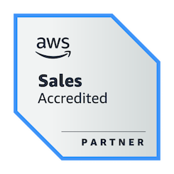

# Computação em Nuvem | AWS Partner

## Sumário

- [Cursos realizados](#cursos)
- [Links e outras referências](#links-e-outras-referências)
- [Badges](#badges)
      
## Cursos

1. [Technical Accreditation | Resumo](technical-accreditation.md)
2. [Business Sales Accreditation | Resumo](sales-acreditation-business.md)
3. [Cloud Economics | Resumo](cloud-economics.md)
4. [Exam Prep | Resumo](exam-prep.md)

## Links e outras referências

- [Technical Accreditation | Badge by Credly](https://www.credly.com/badges/09ade6a7-66e7-4b3a-bd97-4135c888a484/public_url)
- [Cales Accreditation Business | Badge by Credly](https://www.credly.com/badges/697fce93-1d9d-42db-b192-95f9a76e63aa/public_url)
- [Cloud Economics | Badge by Credly](https://www.credly.com/badges/90443b83-00b0-4f81-8444-00c43ccfe030/public_url)
- [Cloud Quest Praticioner | Badge by Credly](https://www.credly.com/badges/86a16e94-e69c-44fc-8397-cfb50cd93d52)

## Badges

 
