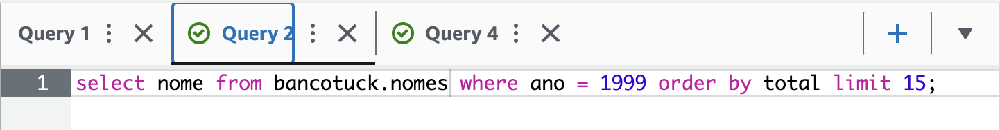

# Data & Analytics - PB - AWS 6/10

> Olá, monitor! 
> 
> Neste arquivo você vai encontrar os objetivos da entrega e as referências dos conteúdos estudados nas últimas duas semanas.
> 
> Qualquer dúvida fico à disposição. 
> 
> Abraços!

### Entregas da Sprint
>
> ### AWS S3
>
> 
> 
> 
>
> ### AWS Athena
> 
> 
> 
> 
> 
> ### AWS Lambda
> 
> 
> - [aws_lambda-template_function](./lambda-function.py)
> - [aws_lambda-dockerfile](./docker/Dockerfile)
>
### Resumo da Sprint
>
> Nesta sprint foi possível conhecer um pouco mais sobre os recursos da AWS para realização do processo de Análise de Dados em nuvem. Apesar de não ter realizado o processo por inteiro, foi possível conhecer e aplicar os conhecimentos dos serviços da AWS S3, AWS Athena e AWS Lambda, o que esclareceu muito dos conceitos teóricos abordado pelos cursos da AWS Skill Builder. 
>