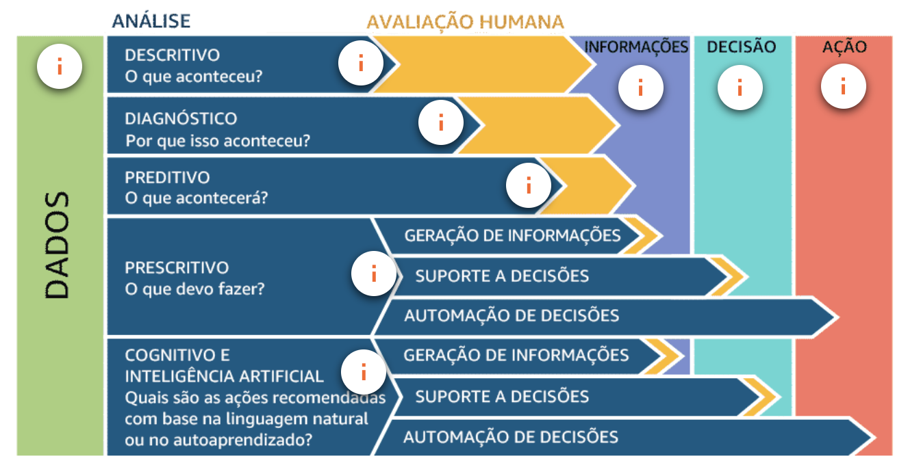

## Fundamentos de Data Analytics

- Como identificar a solução de análise de dados que melhor atenda aos seus requisitos?
- Como planejar e executar uma estratégia para implementá-la?

## Introdução 

### O que é Avaliação (Análise) de dados?

> É um processo de compilar, processar e analisar dados para que você possa tomar decisões.

    → Classificar
    → Agregar
    → Unir e aplicar a lógica do negócio

### Solução de avaliação de dados brutos

Os componentes que envolvem um processo de avaliação de dados são:

- Coleta (Ingerir ou Coletar): montar dados de várias fontes.
- Armazenamento (Armazenar): manter os dados em repositórios.
- Processamento (Processar): manipular dados nas formas que convêm.
- Análise (Analisar): extrair as informações relevantes.
- Entrega (Consumir ou Visualizar): apresentar gráficos e demonstrar valores por relatórios e dashboards.

"Quanto mais próximo o armazenamento dos dados estiverem do sistema de processamento, melhor será o desempenho desse sistema." - AWS

### Fontes de dados

- Dados gerados por humanos
- Dados gerados por máquinas

### Benefícios da Análise de dados em grande escala

- Personalizar ofertas aos clientes;
- Detectar fraudes em transações;
- Detectar (padrões de uso) ameaças à segurança;
- Comportamento do usuário;
- Modelagens e previsões financeiras;
- Alerta (de problemas) em tempo real;

### Desafios de Data Analytics (5Vs)

- Volume
- Velocidade
- Variedade
- Veracidade (Procedência dos dados)
- Valor

## Volume | Armazenamento

> Quando as empresas têm mais dados do que conseguem processar e analisar, elas têm um problema de volume.
>

### Formas de agregar dados

> Você pode entregar ou encontrar dados estruturados, semi-estruturados ou não estruturados.

#### Dados estruturados (10%)

> São volumes de dados que se organizam de maneira relacional e seguem uma regra previamente definida, possuindo atributos desejáveis em uma estratégia de movimentação.
> 
> Organizadas em:
>
> - Tabelas
>   - Linhas
>   - Colunas

#### Dados semiestruturados (10%)
> 
> Não apresentam uma estrutura lógica tão bem definida mas se organizar a uma regra de interesse, todo mundo se encontra
> 
> Organizadas em:
- Conjunto de chaves e valores
    - nome_da_chave: valor
- Arquivos
    - .json
    - .xml
    - .csv
    - .xlsx

#### Dados não-estruturados (80%)
>
> *O que é, o que é, indica desempenho e movimentação de um objeto num determinado período de tempo?* 
> 
> Organizadas em:
    
    void(); // não tem uma organização definida. é o espaço com um tanto escalável de dados tem que colocar tags(*KPIs*) 

> Podem ser encontrados em forma de arquivos ou objetos:
- e-mails;
- fotos;
- documentos textuais;
- videos;

### Amazon S3

Para realizar a comunicação, cada objeto pode ser referenciado através de (i) endpoints de serviços web, (ii)nome do bucket, (iii) da chave e (iv) da versão.

#### Custos
**Free tier**: No primeiro ano, inclui 750 horas de uso de instâncias t2.micro (ou t3.micro nas regiões em que o t2.micro está indisponível) em AMIs de nível gratuito por mês, 30 GiB de armazenamento do EBS, 2 milhões de E/S, 1 GB de snapshots e 100 GB de largura de banda para a Internet

### Benefícios | S3

- Desacoplamento entre o armazém e o processador;
- Arquitetura de dados centralizada;
- Integração com serviços AWS sem cluster e sem servidor;
- Interfaces de programação de aplicativos (APIs) personalizadas;

## Velocidade | Processamento de dados

Processamento de dados em batch;

Processamento de dados em stream.

## Variedade | Estrutura e tipos de dados

Armazenamento de dados de origem;

Datastores estruturados;

Datastores semiestruturados e não estruturados.

## Veracidade | limpeza e transformação

Integridade de dados;

Consistência de bancos de dados;

Processo de ETL

## Valor | Relatórios e Business Intelligence

### Análise de dados

> Em suma, analisar dados é atribuir significado ao que foi coletado. Você como analista de dados deverá descrever ao consumidor do relatório (1) o que ele está vendo, (2) por que é importante e (3) como avançar com as informações fornecidas.

#### Análise de Informações | BI

> Processo que busca encontrar valor contido nas informações coletadas por uma empresa.

Ferramentas 

#### Análise Operacional | POPs

> Processo que busca encontrar valor nas operações digitais de uma empresa.

- [Amazon ElasticSearch Service](https://aws.amazon.com/elasticsearch-service/)

#### Visualização de dados

- [Kibana](https://www.elastic.co/pt/kibana?)
- [Amazon QuickSight]()

### Tipos de Análises

#### Análise Descritiva: O que aconteceu?

- Concentra-se em analisar o passado.
- Coleta e mineração de dados.

#### Análise de Diagnóstico: Por que aconteceu?

- Concentra-se em entender o porquê de ter acontecido.
- Realiza-se a comparação de dados a partir da coleta.
- Busca-se por dependências e padrões entre os dados.

#### Análise Preditiva: O que acontecerá?

- Concentra-se no que já existe de informação e o que pode acontecer.
- Realiza-se a previsão a partir das análises descritivas e diagnósticas prevendo eventos e tendências futuras.
- A precisão do resultado depende da qualidade dos dados e da estabilidade da situação.

- [Amazon Machine Learning]()

#### Análise Prescritiva: O que devo fazer?

- Concentra-se, a partir da previsão, em sugerir ações com menores riscos.
- Realiza-se a entrada dos dados previamente coletados, adicionando regras e otimizações baseadas em restrições.
- Sugestões e personalizações utilizando Machine Learning.

#### Análise Cognitiva(IA): Quais são as ações recomendadas com base na linguagem natural ou no autoaprendizado?

- Sistemas analíticos cognitivos imitam o que o cérebro humano faz, ou seja, geram hipóteses, conexões e restrições a partir de dados existentes.
- Retornam respostas na forma de recomendações e classificações de confiança.