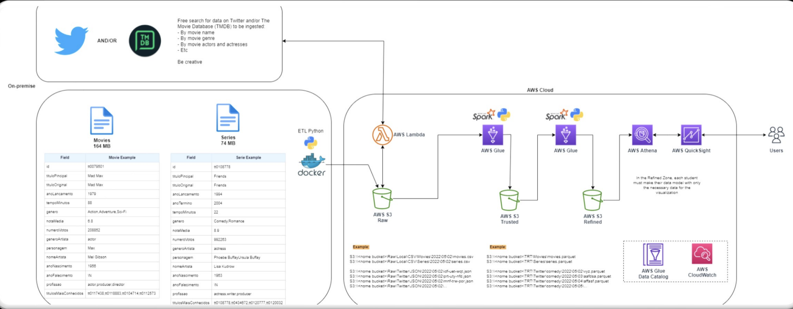

# Desafio Final | CompassUOL

## Sobre

> Este projeto tem como objetivo apropriar os conhecimentos objetidos ao longo de 5 meses.

## Arquitetura do Projeto

## Coleta de dados | Raw

A extração de dados será feita através de uma função periódica utilizando o [AWS Lambda](https://us-east-1.console.aws.amazon.com/lambda/home?region=us-east-1#/functions) a partir de qualquer fonte disponível na internet como o Twitter ou o The Movie DataBase (TMDB).

A coleta poderá ser feita por:

- Nome do filme
- Gênero
- Nome de Atores/Atrizes
- Nome de Personagens
- Etc..

- [Arquivo fornecido](./Filmes+e+Series.zip)

## Armazenamento dos dados | Raw S3

Após ter coletado os dados, seu armazenamento será feito em um bucket do [Amazon S3](https://s3.console.aws.amazon.com/s3/buckets?region=us-east-1), contendo os dados brutos dos filmes e séries selecionados. 

### ETL | Python & Docker

- [Configuração Docker](./sprint_04/python-e-docker/docker/docker.md)

## Desafio Final | Part. 01 | Apache Spark | Contador de palavras

Objetivo: criar código Python que carrega arquivos CSV para a Nuvem utilizando as técnicas de ETL.

- **Ingestão Batch**: a ingestão dos arquivos CSV em Bucket Amazon S3 RAW Zone. Nesta etapa do desafio deve ser construído um código Python que será executado dentro de um container Docker para carregar os dados locais dos arquivos para a nuvem. Nesse caso utilizaremos, principalmente, as lib boto3 como parte do processo de ingestão via batch para geração de arquivo (CSV).

### 1. Implementar código Python

- ler os 2 arquivos (filmes e series) no formato CSV inteiros, ou seja, sem filtrar os dados

- utilizar a lib boto3 para carregar os dados para a AWS

- acessar a AWS e grava no S3, no bucket definido com RAW Zone

      - no momento da gravação dos dados deve-se considerar o padrão: <nome do bucket>\<camada de armazenamento>\<origem do dado>\<formato do dado>\<especificação do dado>\<data de processamento separada por ano\mes\dia>\<arquivo>

            Por exemplo:

                   S3:\\data-lake-do-fulano\Raw\Local\CSV\Movies\2022\05\02\movies.csv

                   S3:\\data-lake-do-fulano\Raw\Local\CSV\Series\2022\05\02\series.csv

### 2. Criar container Docker com um volume para armazenar os arquivos CSV e executar processo Python implementado

### 3. Executar localmente o container docker para realizar a carga dos dados ao S3

