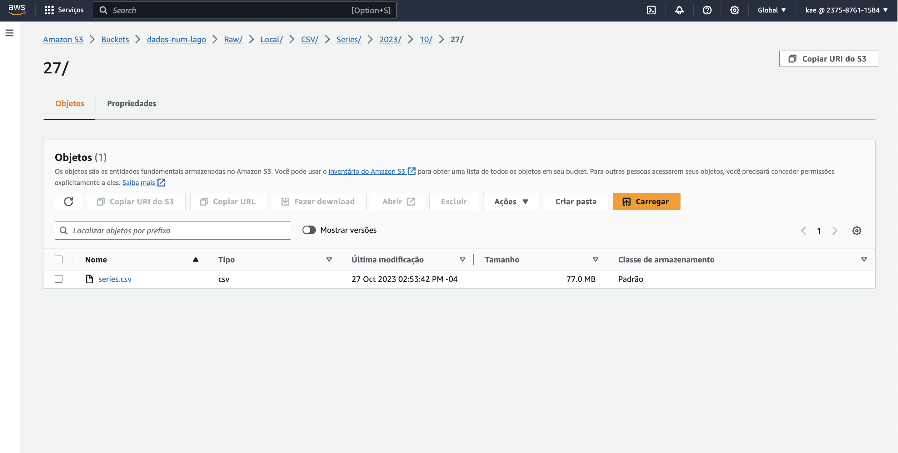

# Desafio Final | CompassUOL

## Sobre

> Este projeto tem como objetivo apropriar os conhecimentos objetidos ao longo de 5 meses.

## Arquitetura do Projeto

## Coleta de dados | Raw Zone

A extração de dados será feita através de uma função periódica utilizando o [AWS Lambda](https://us-east-1.console.aws.amazon.com/lambda/home?region=us-east-1#/functions) a partir de qualquer fonte disponível na internet como o Twitter ou o The Movie DataBase (TMDB).

A coleta poderá ser feita por:

- Nome do filme
- Gênero
- Nome de Atores/Atrizes
- Nome de Personagens
- Etc..

## Desafio Final | Part. 01 | Coleta de Dados 

Objetivo: criar código Python que carrega arquivos CSV para a Nuvem utilizando as técnicas de ETL.

- **Ingestão Batch**: a ingestão dos arquivos CSV em Bucket Amazon S3 RAW Zone. Nesta etapa do desafio deve ser construído um código Python que será executado dentro de um container Docker para carregar os dados locais dos arquivos para a nuvem. Nesse caso utilizaremos, principalmente, as lib [boto3](https://boto3.amazonaws.com/v1/documentation/api/latest/guide/session.html#session) como parte do processo de ingestão via batch para geração de arquivo (CSV).

## Script Final | Part. 01 | Coleta de dados

- [Juyter Notebook | Coleta em Batch -> RAW Zone](/compass/compassuol/sprint_07/desafio_01/ingestao_batch.ipynb)

- [x] Ler os 2 arquivos (filmes e series) no formato CSV inteiros, ou seja, sem filtrar os dados

- [Arquivo a ser upado | 1 | Movies](./movies.csv)
- [Arquivo a ser upado | 2 | Series](./series.csv)

### 1. Implementar código Python

- [x] Utilizar a lib boto3 para carregar os dados para a AWS

- acessar a AWS e grava no S3, no bucket definido com RAW Zone

      - no momento da gravação dos dados deve-se considerar o padrão: 
      
      <nome do bucket>\<camada de armazenamento>\<origem do dado>\<formato do dado>\<especificação do dado>\<data de processamento separada por ano\mes\dia>\<arquivo>

            Por exemplo:

                   S3:\\data-lake-do-fulano\Raw\Local\CSV\Movies\2022\05\02\movies.csv

                   S3:\\data-lake-do-fulano\Raw\Local\CSV\Series\2022\05\02\series.csv

### 2. Criar container Docker com um volume para armazenar os arquivos CSV e executar processo Python implementado

      docker run -it -v /Users/camilabudke/Desenvolvimento/compass/compassuol/sprint_07/desafio_01:/home/glue_user/ -v ~/.aws:/home/glue_user/.aws -p 8888:8888 --name glue_jupyter_prod amazon/aws-glue-libs:glue_libs_4.0.0_image_01 /home/glue_user/jupyter/jupyter_start.sh

### 3. Executar localmente o container docker para realizar a carga dos dados ao S3

#### Movies

#### Series

## Consumo de APIs | Armazenamento de dados

Objetivo: criar um processo de extração de dados da API do TMDB utilizando serviços da AWS.

### Sobre API's

Uma API (Application Programming Interface) é um conjunto de regras, protocolos e ferramentas que permitem que diferentes sistemas de software se comuniquem e troquem informações de forma eficiente e padronizada.

Em outras palavras, uma API é uma interface que **permite que desenvolvedores de software acessem dados ou funcionalidades de um sistema ou aplicativo sem precisar conhecer todos os detalhes internos do sistema**. Deste modo, a API fornece uma maneira de acessar esses recursos de forma programática, geralmente usando requisições HTTP (Hypertext Transfer Protocol) para recuperar e/ou enviar dados.

A API TMDB é uma **API RESTful**, o que significa que *os dados são acessados através de URLs que correspondem a recursos específicos*. Os desenvolvedores podem acessar informações de busca, detalhes de filmes e programas de TV, imagens e informações relacionadas a gêneros e classificações.

Para saber mais sobre a API do The Movie Database, visite o [site oficial](https://www.themoviedb.org/documentation/api) e verifique os [termos de uso](https://www.themoviedb.org/documentation/api/terms-of-use).

Para a realização das atividades é de grande importância que você faça a leitura da [documentação](https://developers.themoviedb.org/3/movies/get-movie-details).

Esta atividade corresponde a um laboratório. Não esperamos que você registre resposta neste espaço. Contudo, deves adicionar o código-fonte produzido ao seu repositório no Github. Lembre-se de remover suas credenciais de acesso antes de efetuar commit.

Perguntas dessa tarefa

- [x] Etapa 1 -  Criando sua conta no TMDB

Será preciso criar uma conta no porta do TMDB para, após, solicitar as chaves de acesso para uso da API.

Os passos são:

- Acessar o portal pelo link https://www.themoviedb.org/

- Clique no botão Junte-se ao TMDB na barra de navegação no topo da página

- Preencha o formulário de inscrição com as informações solicitadas e clique em Registrar. Utilize seu e-mail pessoal neste passo.

-  Você irá receber um e-mail de confirmação. Siga o processo solicitado

- Faça login em sua nova conta no TMDB e vá para o seu perfil, clicando no ícone de usuário no canto superior direito da página

- Clique na guia  Visão geral, opção Editar Perfil

- Clique no menu API, à esquerda. A seguir, na opção Criar, escolhendo o tipo Developer

- Aceite os termos e preencha o formulário com as informações solicitadas sobre a aplicação.

----- Em Tipo de Uso, informe Pessoal

----- Em URL, você pode informar um endereço fictício.

----- No Resumo, informe que o objetivo é para estudos

- [x] Etapa 2 - Testando rapidamente as credenciais e a biblioteca

Uma vez que você tenha sua chave de API, você pode fazer solicitações à API usando a seguinte estrutura de URL:

      https://api.themoviedb.org/3/{endpoint}?api_key={sua_chave_de_api}&{parâmetros_opcionais}

Onde {endpoint} é o recurso que você deseja acessar (por exemplo, movie/{movie_id} para obter detalhes de um filme específico) e {parâmetros_opcionais} são quaisquer parâmetros adicionais que você deseje incluir na solicitação (por exemplo, language=pt-BR para obter informações em português).

### Abaixo exemplo de código Python

      import requests
      import pandas as pd

      from IPython.display import display

      api_key = "SUA CHAVE"

      url = f"https://api.themoviedb.org/3/movie/top_rated?api_key={api_key}&language=pt-BR"

      response = requests.get(url)
      data = response.json()

      filmes = []

      for movie in data['results']:
      df = {'Titulo': movie['title'],
      'Data de lançamento': movie['release_date'],
      'Visão geral': movie['overview'],
      'Votos': movie['vote_count'],
      'Média de votos:': movie['vote_average']}

      filmes.append(df)

      df = pd.DataFrame(filmes)
      display(df)

## Desafio Final | Part. 02 | Armazenamento de dados

Objetivo: Capturar dados existentes na API TMBD e enriquecer o conjunto a ser analisado. 

### Armazenamento de dados | Raw Zone on S3

Após ter coletado os dados, seu armazenamento será feito em um bucket do [Amazon S3](https://s3.console.aws.amazon.com/s3/buckets?region=us-east-1), contendo os dados brutos dos filmes e séries selecionados. 

### Ingestão streaming/micro batch

Neste etapa do desafio iremos capturar dados do TMDB via [AWS Lambda](https://us-east-1.console.aws.amazon.com/lambda/home?region=us-east-1#/functions) realizando chamadas de API. Os dados coletados devem ser persistidos em Amazon S3, camada RAW Zone, mantendo o formato da origem (JSON) e, se possível, agrupando-os em arquivos com, no máximo, 100 registros cada.

O objetivo desta etapa é complementar os dados dos Filmes e Series, carregados na Etapa 1, com dados oriundos do TMDB e, opcionalmente, de outra API de sua escolha.

#### Importante

- Os arquivos CSVs carregados na Etapa 1 não devem ser modificados.
- Os novos dados devem ser complementares aos dados do CSV. **Tem que existir informações novas sobre os dados do CSV.**
- Não é necessário realizar tratamento dos dados externos, o máximo que pode ser feito é o **agrupamento de dados**.
- Cuidado para os arquivos JSON gerados não serem maior do que **10 MB**.
- Não agrupe JSON com estruturas diferentes.
- Os IDs do IMDB presentes nos arquivos CSV podem ser utilizados em pesquisas no TMDB.
- Se você escolher fazer **sobre um filme** ou uma **trilogia específica**, considere utilizar *pelo menos* 4 métodos de API diferentes para possibilitar uma análise de dados qualificada.
- Considere desenvolver seu código localmente primeiro e com poucos dados para depois leva-lo para a AWS Lambda e aumentar a pesquisa de dados. APIs normalmente limitam requisições. Evite realizar muitas requisições em fase de desenvolvimento ou teste para evitarmos qualquer bloqueio na conta de vocês.

### Atividades

Em sua conta AWS, no serviço AWS Lambda, realize as seguintes atividades:

1. [x] [Criar nova camada]() (layer) no AWS Lambda para as libs necessárias à ingestão de dados.

2. [] Implementar o código Python em AWS Lambda para consumo de dados do TMDB:

- [Script.py](./lambda-function.py)

      python lambda_local.py --JOB_NAME PegaDadosTMDB --S3_INPUT_PATH  --S3_TARGET_PATH s3://dados-num-lago/Raw/

   - Se está utilizando Twitter, buscar os tweets de interesse para a análise (neste ponto você já deve ter definido qual análise planeja realizar com os dados) e agrupar os tweets em arquivo JSON com, no máximo, 100 registros cada

   - Se está utilizando TMDB,  buscar pela API os dados que complementem a análise

   - Utilizar a lib boto3 para gravar os dados no AWS S3

    -----| no momento da gravação dos dados deve-se considerar o padrão de path: <nome do bucket>\<camada de armazenamento>\<origem do dado>\<formato do dado>\<especificação do dado>\<data de processamento separada por ano\mes\dia>\<arquivo>

              São exemplos de caminhos de arquivos válidos:

               - S3:\\data-lake-do-fulano\Raw\TMDB\JSON\2022\05\02\prt-uty-nfd.json

               - S3:\\data-lake-do-fulano\Raw\TMDB\JSON\2022\05\02\idf-uet-wqt.json

**Informação adicional:**

Podemos utilizar os serviços  CloudWatch Event ou Amazon EventBridge para agendar extrações periódicas de dados no Twitter de forma automática.

## Referências

- [Artigo como instalar os módulos do python na aws lambda usando camadas](https://satellasoft.com/artigo/aws/como-instalar-modulos-do-python-na-aws-lambda-usando-camadas)
- [Creating Lambda Layers Made Easy with Docker: A Developer’s Guide](https://medium.com/simform-engineering/creating-lambda-layers-made-easy-with-docker-a-developers-guide-3bcfcf32d7c3)