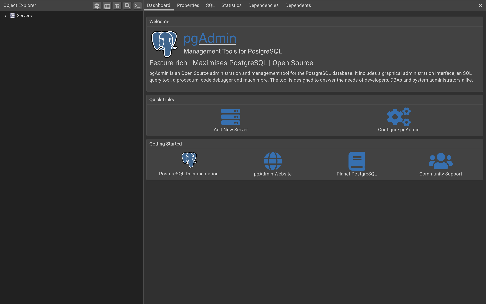
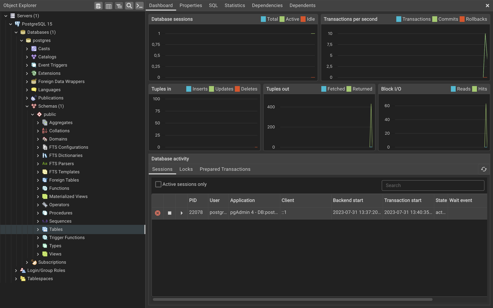
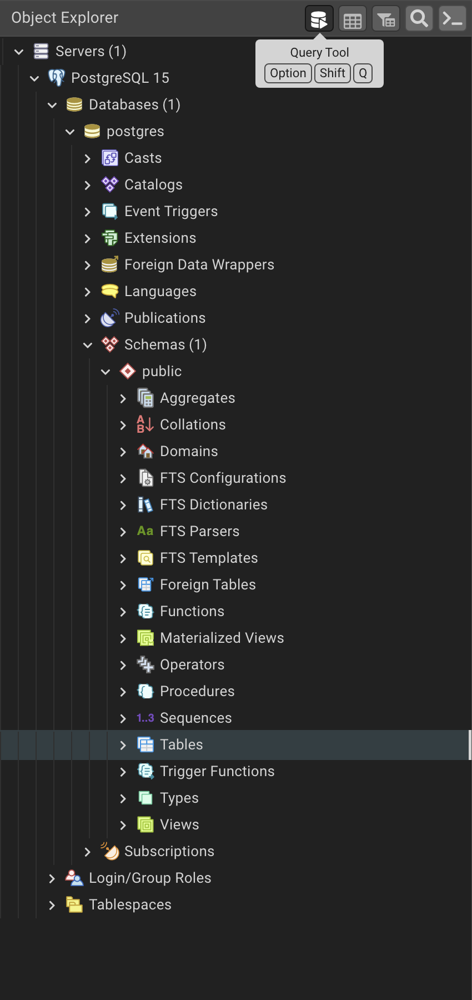
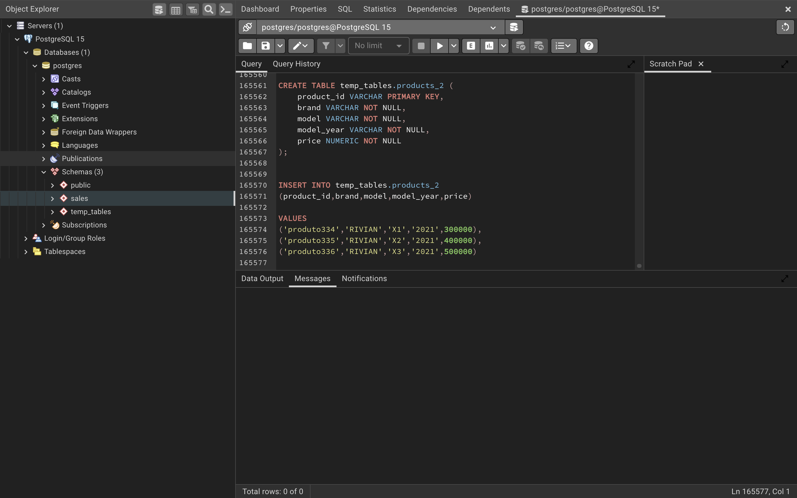
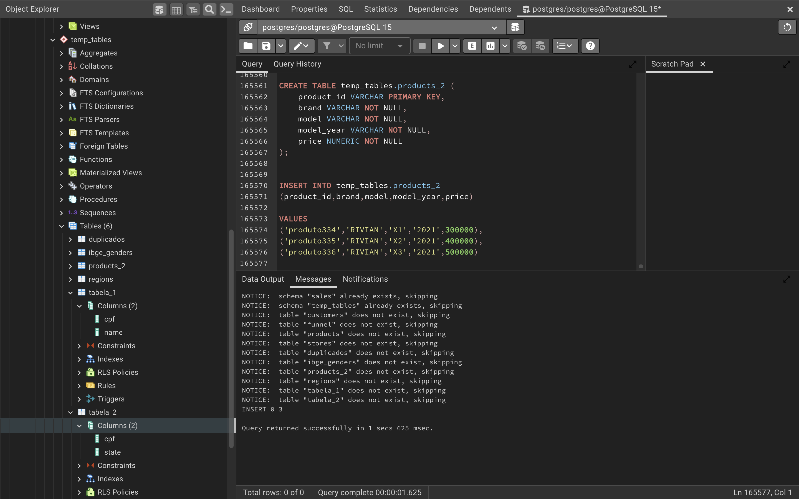
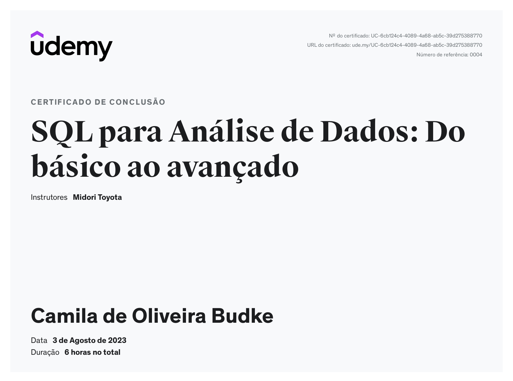

## Sumário | PostgreSQL

- [x] [Setup](#setup)
- [x] [Documentação | PostGreSQL e SQLite](#documentação)
- [x] [Overview | PgAdmin 4.15](#overview--pgadmin-415)
- [x] [Configuração do BD](#configuração-do-bd--análise-de-dados)
- [x] [Fundamentos | Comandos](#fundamentos--comando)
- [x] [Fundamentos | Operadores](#fundamentos--operadores)
- [x] [Fundamentos | Comandos Avançados](#fundamentos--comandos-avançados)
- [x] [Caso de Estudo | Biblioteca](#caso-de-estudo--biblioteca)
- [x] [Caso de Estudo | Loja](#caso-de-estudo--loja)
- [x] [Tratamento de Dados](#tratamento-de-dados)
- [x] [Manipulação de tabelas](#manipulação-de-tabelas)
- [x] [Projeto 1 | Dashboard de acompanhamento de vendas]()
- [x] [Projeto 2 | Análise de perfil dos clientes]()
- [x] [Links e outras referências](#links-ou-referências)
- [x] [Certificado](#certificado)

## Setup
>
> Para começar a estudar SQL você vai precisar baixar e instalar os seguintes componentes:
>
> - [pgAdmin](https://www.pgadmin.org/): software gráfico para administração do PostgreSQL;
> - [PostgreSQL](https://www.postgresql.org/docs/): sistema gerenciador do banco de dados (SGBD);
> - [Configurar o Banco de Dados (BD)](config_bd.sql): através da execução de um script;
>
> Baixe o pgAdmin pelo pacote, pois este irá conter tanto o _pgAdmin_ quanto o _PostgreSQL_.
>
> > #### Porta do servidor: 5433
>

## Overview | pgAdmin 4.15
>
> Ao abrir o pgAdmin você irá encontrar a seguinte interface:
>
> 
>
> O que nos será útil no momento será a **Visualização de Tabelas** e o **Query Tool**.
>
> Clicando em servidores (Servers) pela árvore de trabalho (Working Tree / Object Explorer):
>
> 
>
> Para encontrar o Query Tool, selecione o ícone ao lado de Object Explorer, como na imagem abaixo, ou digite `option` + `shift` + `q`.
>
> 

## Configuração do BD | Análise de dados
>
> Para realizar a análise de dados de um determinado contexto, é necessário ter em mãos:
>
> 1. O diagrama dos objetos do negócio: **_schema_**;
>
>    
>
> 2. O código de comandos para criação de tabelas e colunas do BD: **_script_**;
>
>    [Script](./query-completa.txt)
>
> ### Configuração | pgAdmin
>
> 1. Vá em schema e crie mais 2 objetos: _sales_ e  _temp_tables_:
>
>    
>
> 2. Vá em Query Tools/Editor e insira o script para gerar todas as tabelas:
>
>     
>
> 3. Clique em F5 para executar o script e você terá uma interface semelhante a esta:
>
>      
>
## Documentação 
>
> - [SQL Sintaxe | W3S](https://www.w3schools.com/sql/)
> - [PostGreSQL | Manual](https://www.postgresql.org/docs/current/)
> - [PostGreSQL | Instalação MacOS](https://www.postgresql.org/docs/current/installation-platform-notes.html#INSTALLATION-NOTES-MACOS)
> - [SQLite | Manual](https://www.sqlite.org/doclist.html)
> - [SQLite | Instalação](https://www.sqlite.org/zeroconf.html)
> - [SQLite | Biblioteca Python](https://docs.python.org/3/library/sqlite3.html)
>

## Fundamentos | Comando
>
### SELECT | Comandos Básicos
>
> O comando [SELECT](https://www.postgresql.org/docs/15/queries-select-lists.html) é utilizado para selecionar e retornar as colunas de uma determinada tabela dentro de um determinado contexto.
>
> **Exercícios de Exemplo**
>
> - [SELECT]()
>

### DISTINCT | Comandos Básicos
>
> O comando [DISTINCT](https://www.postgresql.org/docs/15/queries-select-lists.html#:~:text=be%20passed%20on.-,7.3.3.%C2%A0DISTINCT,-After%20the%20select) é utilizado para remover linhas duplicadas e entregar linhas não repetidas.
>
> > **No mundo dos negócios...**
> >
> > Pode ser utilizado para entender quais tipos de dados compõe aquela coluna ou qual é a sua forma canônica dentro do BD.
>
>
> **Exercícios de Exemplo**
>
> - [DISTINCT]()
>

### WHERE | Comandos Básicos
>
> O comando [WHERE](https://www.postgresql.org/docs/15/queries-table-expressions.html#QUERIES-WHERE) é utilizado para filtrar as buscas de acordo com a condição de interesse.
>
> > **Mundo dos Negócios**
> >
> > Pode ser utilizado para retirar dados de clientes em potenciais de compra (leads), fornecendo as condições de análise da equipe de marketing.
> >
>
> **Exercícios de Exemplo**
>
> - [WHERE]()
>

### ORDER BY | Comandos Básicos
>
> O comando [ORDER BY](https://www.postgresql.org/docs/15/queries-order.html) é utilizado para ordenar as buscas de acordo com a regra definida pelo usuário.
>
> > **Mundo dos Negócios**
> >
> > Pode ser utilizado para retirar dados de clientes em potenciais de compra (leads) e realisar a análise do perfil.
>
**Exercícios de Exemplo**
>
> - [ORDER BY]()
>

### LIMIT | Comandos Básicos
>
> O comando [LIMIT](https://www.postgresql.org/docs/15/queries-limit.html) é utilizado para limitar o número de linhas no output da query. Isso diminui o gasto com processamento do servidor para tabelas com muitas linhas.
>
> > **Mundo dos Negócios**
> >
> > É comumente utilizado para reduzir o processamento do servidor, diminuindo gastos com a infraestrutura ou apenas verificar os X primeiros resultados.
>
> **Exercícios de Exemplo**
>
> - [LIMIT]()
>

## Fundamentos | Operadores

### Aritméticos
>
> | Adição | Subtração | Multiplicação | Divisão | Exponencial | Módulo ou Coringa |  |
> | ---| --- | --- | --- | --- | --- | --- |
> | + | - | * | \ | ^ | % | |\| |
>
> #### Concatenação de Strings
>
> **Sintaxe**
>
>     select 
>       first_name,
>       last_name,
>       first_name || ' ' || last_name as nome_completo
>     from sales.customers
>
> **Exercícios de Exemplo**
>
> - [Operadores Aritméticos e Concatenação]()
>

### Operadores de Comparação
>
> | Igual | Maior que | Menor que |  Maior ou igual que | Menor ou igual que | Diferente de |
> | --- | --- | --- | --- | --- | --- |
> | = | > | < | >= | <= | <> |
>
> **Exercícios de Exemplo**
>
> - [Comparação]()
>

### Operadores Lógicos 
>
> | E | Ou | Negação | Entre | Em  | Semelhante a | Semelhante a (maiúsculas e minúsculas) | É nulo |
> | --- | --- | --- | --- | --- | --- | --- | --- |
> | AND | OR | NOT | BETWEEN | IN | LIKE | ILIKE | IS NULL |
>
> **Exercícios de Exemplo**
>
> - [Lógicos]()
>

## Fundamentos | Comandos Avançados

### Funções Agregadas
>
> As [funções agregadas](https://www.postgresql.org/docs/15/functions-aggregate.html) são funções semelhantes às utilizadas nas planilhas de excel para contagem, mínimo, máximo e média de uma coluna.
>
> **Exercícios de Exemplo**
> 
> - [Funções agregadas]()
>

### GROUP BY | Funções Agregadas
>
> O comando [GROUP BY](https://www.w3schools.com/sql/sql_groupby.asp) é utilizado para fazer agrupamentos entre colunas. Geralmente é utilizado com [funções agregadas](#funções-agregadas), além de ser visto também ao analisar dados de um determinado grupo (Clientes) por um atributo desse grupo (País de origem).
>
> - [GROUP BY]()
>

### HAVING | Funções Agregadas
>
> O comando [HAVING](https://www.w3schools.com/sql/sql_having.asp) é utilizado para filtrar funções agregadas. 
> 
> - [HAVING]()
>

## Joins | Relacionamentos
> 
> As [joins](https://www.w3schools.com/sql/sql_join.asp) são junções realizadas entre duas tabelas do BD a partir de uma coluna em comum (link é feito pelas PKs e FKs). É o comando utilizado para relacionar duas tabelas.
>
> As convenções para nomenclatura são:
>
> - Tabela da esquerda (A) é a tabela que foi declarada primeiro.
> - Tabela da direita (B) é a tabela que foi declarada em seguida.
>

## Tipos de Joins | Relacionamentos
>
> ### Left Join 
>
> Ele seleciona todos os dados de uma coluna da `tabela esquerda` e todos os dados da `tabela direita` em `match` existentes pela mesma coluna.
>
> 
> 
>
> - [Left Join | Exemplos]()
>
> ### Inner Join
>
> Seleção de todos os dados que deram match.
>
>  
>
> - [Inner Join | Exemplos]()
>
> ### Right Join
>
> Seleção de todos os dados de uma coluna da tabela direita + todos os dados com match da tabela esquerda.
>
> 
>
> - [Right Join | Exemplos]()
>
> ### Full Join
>
> Seleção de todos os dados de ambas as tabelas, seguido da junção em uma nova tabela.
>
> 
>
> - [Full Join | Exemplos]()
>

## Unions
>
> É um comando utilizado para "colar" uma tabela sobre a outra, desde que estas tenham `a mesma quantidade de colunas e linhas`.
>
> ### Tipos de Union
>
> Considere duas tabelas fictícias: a 1 e a 2:
> ### Union
> 
> > Utiliza-se quando os tipos de ambas as tabelas forem os mesmos, `int`, por exemplo. 
> >
> > Caso haja uma tabela contendo, em alguma coluna, um tipo diferente, como `float`, vai dar erro.
> >
> > - [Union | Exemplo]()
> > 
>
> ### Union All
> 
> > Utiliza-se o mesmo conceito, entretanto, ele não remove as linhas duplicadas, te entregando `dados brutos`.
> > 
> > - [Union All | Exemplo]()
>

## Subqueries
>
> É utilizado para realizar consultas dentro de outras consultas, reutilizando os dados dessa busca dentro da query principal.
>
> ### Tipos
>
> - [WHERE | Subquery]()
> - [WITH | Subquery]()
> - [FROM | Subquery]()
> - [SELECT | Subquery]()
>

## Caso de Estudo | Biblioteca
>
> ### Schema
>
> 
>
> ### Exercícios | Udemy
> 
> - [Exercício 1](./exercicios-sqlite/biblioteca/ex01.sqlite)
> - [Exercício 2](./exercicios-sqlite/biblioteca/ex02.sqlite)
> - [Exercício 3](./exercicios-sqlite/biblioteca/ex03.sqlite)
> - [Exercício 4](./exercicios-sqlite/biblioteca/ex04.sqlite)
> - [Exercício 5](./exercicios-sqlite/biblioteca/ex05.sqlite)
> - [Exercício 6](./exercicios-sqlite/biblioteca/ex06.sqlite)
> - [Exercício 7](./exercicios-sqlite/biblioteca/ex07.sqlite)
> 
## Caso de Estudo | Loja
>
> ### Schema
>
> 
>
> ### Exercícios | Udemy
> 
> - [Exercício 8](./exercicios-sqlite/loja/ex08.sqlite)
> - [Exercício 9](./exercicios-sqlite/loja/ex09.sqlite)
> - [Exercício 10](./exercicios-sqlite/loja/ex10.sqlite)
> - [Exercício 11](./exercicios-sqlite/loja/ex11.sqlite)
> - [Exercício 12](./exercicios-sqlite/loja/ex12.sqlite)
> - [Exercício 13](./exercicios-sqlite/loja/ex13.sqlite)
> - [Exercício 14](./exercicios-sqlite/loja/ex14.sqlite)
> - [Exercício 15](./exercicios-sqlite/loja/ex15.sqlite)
> - [Exercício 16](./exercicios-sqlite/loja/ex16.sqlite)
>

## Tratamento de dados
>
> ### Comandos
>
> - [Operador `::`](https://learnsql.com/blog/double-colon-operator-postgresql/): transforma o dado no tipo de interesse, como por exemplo `'2023-04-10'::date`
> 
> - [CAST](https://www.w3schools.com/sql/func_sqlserver_cast.asp): realiza a mesma transformação, mas por vias diferentes.
>
> ### Tratamento Geral
>
> - [CASE WHEN](https://www.w3schools.com/sql/sql_case.asp): estabelece as condicionais para cada situação.
> - [COALESCE](https://www.w3schools.com/sql/func_sqlserver_coalesce.asp): retorna o primeiro valor não-nulo da lista.
>
> ### Tratamento de Texto
>
> - [UPPER](https://www.w3schools.com/sql/func_sqlserver_upper.asp): transforma todas as letras para maiúsculas.
> - [LOWER](https://www.w3schools.com/sql/func_sqlserver_lower.asp): transforma todas as letras para minúsculas.
> - [TRIM](https://www.w3schools.com/sql/func_sqlserver_trim.asp): remove espaços de uma string.
> - [REPLACE](https://www.w3schools.com/sql/func_sqlserver_replace.asp): substitui um caracter por outro.
>
> ### Tratamento de Datas
>
> - [DATE_ADD | INTERVAL](https://www.w3schools.com/sql/func_mysql_date_add.asp): retorna uma nova data com o intervalo corrigido.
> - [DATE_TRUNC](https://www.w3resource.com/PostgreSQL/date_trunc-function.php): arredonda a data. 
> - [EXTRACT](https://www.w3schools.com/sql/func_mysql_extract.asp): extrai partes de uma data.
> - [DATEDIFF](https://www.w3schools.com/sql/func_mysql_datediff.asp): retorna o número de dias entre duas datas.
>
> ### Funções
> 
> - [Sintaxe para construir uma nova função](https://halleyoliv.gitlab.io/pgdocptbr/sql-createfunction.html)
>
> ### Exemplos
>
> - [Conversões](./exercicios-postgresql/7_tratamento-de-dados/conversoes.sql)
> - [Tratamento Geral](./exercicios-postgresql/7_tratamento-de-dados/tratamento_geral.sql)
> - [Tratamento Texto](./exercicios-postgresql/7_tratamento-de-dados/tratamento_texto.sql)
> - [Tratamento de Datas](./exercicios-postgresql/7_tratamento-de-dados/tratamento_datas.sql)
> - [Criando Funções](./exercicios-postgresql/7_tratamento-de-dados/funcoes.sql)
>

## Manipulação de tabelas
>
> ### Criação, Atualização e Deleção | Tabelas
>
> - [CREATE TABLE](https://www.w3schools.com/sql/sql_create_table.asp)
> - [ALTER TABLE](https://www.w3schools.com/sql/sql_alter.asp)
> - [DROP TABLE](https://www.w3schools.com/sql/sql_drop_table.asp)
>
> ### Inserção, Atualização e Deleção | Linhas
>
> - [INSERT INTO]()
> - [UPDATE SET]()
> - [DELETE FROM]()
>
> ### Inserção, Atualização e Deleção | Colunas
>
> - [ADD COLUMN](https://www.w3schools.com/sql/sql_alter.asp)
> - [ALTER COLUMN](https://www.w3schools.com/sql/sql_ref_alter_column.asp)
> - [DROP COLUMN](https://www.w3schools.com/sql/sql_ref_drop_column.asp)
>
> ### Exemplos
>
> - [Tabelas | CD](./exercicios-postgresql/8_tabelas/create-e-delete.sql)
> - [Linhas | CUD](./exercicios-postgresql/8_tabelas/insert-update-delete-linhas.sql)
> - [Colunas | CUD](./exercicios-postgresql/8_tabelas/insert-update-delete-colunas.sql)
>

## Projeto 1 | Dashboard de acompanhamento de vendas
>
> > **Objetivo**: Criar um dashboard de vendas com os principais indicadores de desmpenho e com os principais drivers dos resultados do mês.
>
> ### Queries
>
> - [Queries](./exercicios-postgresql/9_projeto1-dashboard-de-vendas/queries.sql)
>
> ### Gráficos
>
> - [Dashboard](./exercicios-postgresql/9_projeto1-dashboard-de-vendas/dashboard-de-vendas.xlsx)
>

## Projeto 2 | Análise de perfil dos clientes
>
> > **Objetivo**: Criar um dashboard que analise as principais características dos leads que visitam o nosso e-commerce.
>
> ### Queries
>
> - [Queries](./exercicios-postgresql/10_projeto2-perfil-dos-leads/queries.sql)
>
>
> ### Gráficos
>
> - [Dashboard](./exercicios-postgresql/10_projeto2-perfil-dos-leads/dashboard_analise-de-perfil-clientes.xlsx)
>

## Links ou referências
>
> - [Documentação | PostgreSQL 15](https://www.postgresql.org/docs/15/index.html)
> - [Documentação | SQLite](https://www.sqlite.org/lang.html)
>

## Certificado
>
> 
>