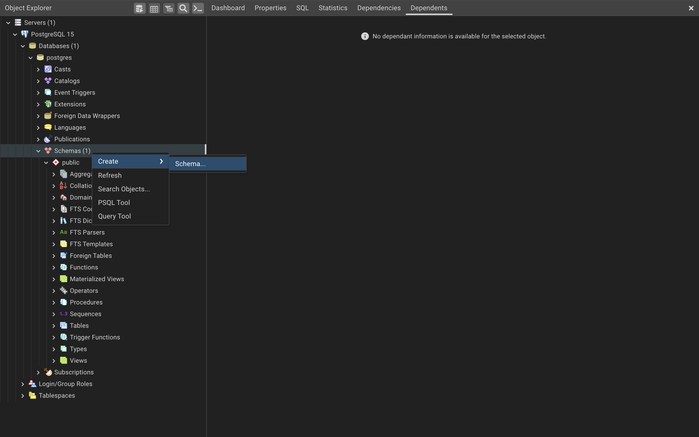

## Sumário | SQL

- [ ] Setup
- [ ] Fundamentos
- [ ] Lista de comandos
- [ ] Conceitos básicos sobre Dados
- [ ] Links e outras referências
- [ ] Certificado

## Setup
>
> Para começar a estudar SQL você vai precisar baixar e instalar os seguintes componentes:
>
> - [pgAdmin](https://www.pgadmin.org/): software gráfico para administração do PostgreSQL;
> - [PostgreSQL](): sistema gerenciador do banco de dados (SGBD);
> - Configurar o Banco de Dados (BD): através da execução de um script;
>
> > Ao baixar o [pgAdmin](https://www.pgadmin.org/), busque pelo pacote. Este vai conter tanto o _pgAdmin_ quanto o _PostgreSQL_.
>
> > #### Porta do servidor: 5433
>

## Overview | pgAdmin 4.15
>
> Ao abrir o pgAdmin você irá encontrar a seguinte interface:
>
> 
>
> O que nos será útil no momento será a visualização de tabelas, clicando em servidores (Servers) pela árvore de trabalho (Working Tree / Object Explorer):
>
> 
>

## Configuração do BD
>
> Para realizar a análise de dados de um determinado contexto, é necessário ter em mãos o diagrama dos objetos do negócio, **_schema_**, e o texto contendo os comandos para criação de tabelas e colunas, **_script_**.
>
> **Schema**
>
> 
>
> **Script**
>
> [Query Completa](./query-completa.txt)
>
> #### Configuração
>
> 1. Vá em schema e crie mais 2 objetos: _sales_ e  _temp_tables_:
>
>    
>
>
> 2. Vá em Query Tools/Editor e insira o script para gerar todas as tabelas:
>
>     
>
> 3. Clique em F5 para executar o script e você terá uma interface semelhante a esta:
>
>      
>
>
## Lista de Comandos
> 
> ### SELECT
>
>   **Para quê serve?**
> 
>     O comando SELECT é utilizado para selecionar as colunas de tabelas
>
>   **Sintaxe**
> 
>     select coluna_1, coluna_2, coluna_3
>     from schema_1.tabela_1
>
>   **Exercícios**
>
>   - [SELECT](./exercicios/1_comandos/sem-resposta/01-Comandos+básicos-SELECT.txt)
>   - [SELECT | Gabarito](./exercicios/1_comandos/com-resposta/01-Comandos+básicos-SELECT+(resolução).txt)
>   - [SELECT | Respondido](./exercicios/1_comandos/select_resp.sql)
>
> 
> ### DISTINCT
>
>   **Para quê serve?**
> 
>     O comando DISTINCT é utilizado para remover linhas duplicadas e entregar linhas distintas ou diferentes.
> 
>     É utilizado para entender quais tipos de dados compõe aquela coluna.
>
>   **Sintaxe**
> 
>     select distinct coluna_1, coluna_2, coluna_3
>     from schema_1.tabela_1
>
>   **Exercícios**
>
>   - [DISTINCT](./exercicios/1_comandos/sem-resposta/02-Comandos+básicos-DISTINCT.txt)
>   - [DISTINCT | Gabarito]()
>   - [DISTINCT | Respondido]()
>
>
> ### WHERE
>
> ### ORDER BY
>
> ### LIMIT
>
## Operadores
>
> ### Aritméticos
>
> ### Comparação
>
> ### Lógicos
>
## Funções agregadas
>
> ### GROUP BY
>
> ### HAVING
>
## Joins
>
> ### Comandos
>
> ### Tipos
>
> ### Exemplos
>
## Unions
>
> ### Comandos
>
> ### Tipos
>
> ### Exemplos
>
## Subqueries
>
> ### Tipos
>
> ### Exemplos
>
## Tratamento de dados
>
> ### Comandos
>
> ### Conversão de unidades
>
> ### Tratamento Geral
>
> ### Tratamento de Texto
>
> ### Tratamento de Datas
>
> ### Funções
>
## Manipulação de tabelas
>
> ### Tabelas | Geral
>
> - #### Criação
>
> - #### Deleção
>
> ### Linhas
>
> - #### Inserção
>
> - #### Atualização
>
> - #### Deleção
>
> ### Colunas
>
> - #### Inserção
>
> - #### Atualização
>
> - #### Deleção
>
## Projeto 1 | Dashboard de acompanhamento de vendas
>
> ### Queries
>
> ### Gráficos
>
## Projeto 2 | Análise de perfil dos clientes
>
> ### Queries
>
> ### Gráficos
>

## Certificado
>